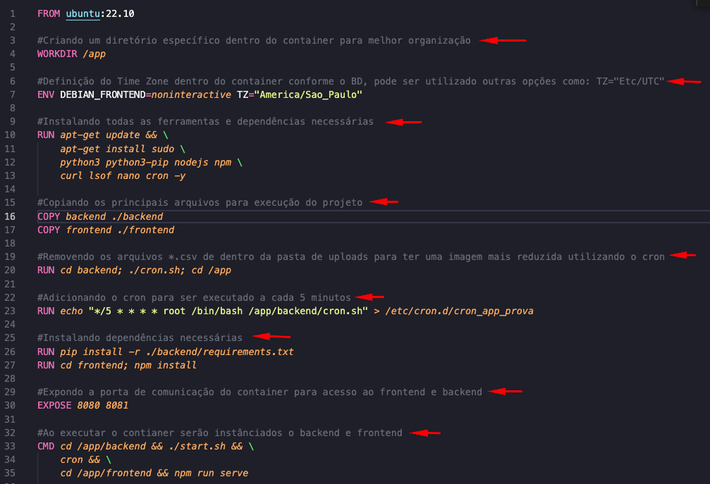

# Documentação Prova Prática Devops Enginner Pleno


## Sobre

Este é um projeto referente ao processo seletivo para DevOps Enginner Pleno.

Toda a construção do projeto foi utilizado o conceito de namespace, por questões de organização e também por motivos de controle sobre o acesso.

Como apoio na organização dos códigos e branches foi utilizada a extensão do git que foi o `Git-Flow`. 

## Requisitos para utilização do script

Segue todos os requisitos necessários para utilização do script:

1- Garantir todas as instalações que estão no arquivo INSTALL.MD. 

2- Realizar a instalação do Make(Ferramenta utilizada para automatizar o processo de contrução de imagens docker).

Segue os passos para instalação em sistemas Linux:
```
$ sudo apt-get update
$ sudo apt-get install make

```

## Dockerfile

O dockerfile na qual está localizado na raiz do projeto foi desenvolvido utilizando boas práticas priorizando sempre a redução do tamanho da imagem e garantindo que as layers sejam executadas de forma performática.

Apesar do formato yaml ser bem legível por nós humanos foi documentado o `Dockerfile.yaml` a partir de comentários todos os passos realizados e a definição de cada passo conforme imagem abaixo:



## Ambiente de Desenvolvimento

Para o ambiente de desenvolvimento utilizamos o `Make` que é uma ferramenta utilizada para automações de processos sendo muito útil para ambiente de desenvolvimento aumentando a produtividade e eficiência, sendo assim todo o processo de build da imagem, run e compose build foram utilizando essa ferramenta.

### docker-compose.yaml

O `docker-compose.yaml` na qual está localizado na raiz do projeto foi construido com todas as configurações de variáveis de ambiente, armazenamento de dados persistentes, devidas exposições de portas no ambiente e inclusão de regras para definição de ordem de inicialização.

### Utilização do Script

Atualmente existem 3 funcionalidades disponíveis para utilização do script, sendo elas:
1-build:
    O comando `build` executa a construção da imagem a partir das instruções que estão presentes no `Dockerfile.yaml`, executa o comando `cron.sh` removendo os arquivos *.csv de dentro da pasta de uploads do Backend para ter uma imagem mais reduzida e em específico informa o nome da imagem sendo `app-prova`.
    A partir do diretório raiz do projeto execute o comando abaixo:
```
$ make build
```

2-run:
    O comando `run` executa a imagem `app-prova` gerada a partir do comando de build visto anteriormente. 
    A partir do diretório raiz do projeto execute o comando abaixo:

```
$ make run
```

3-compose:
    O comando `compose` ele é o responsável por subir todo o projeto e pronto para ser utilizado.
    Este comando executa a construção da imagem a partir das instruções que estão presentes no `Dockerfile.yaml`, executa o comando `cron.sh` removendo os arquivos *.csv de dentro da pasta de uploads do Backend para ter uma imagem mais reduzida faz o build da imagem e up da imagem gerada, isso faz com que todos os containers necessários para que a aplicação seja executada fiquem disponíveis.
    A partir do diretório raiz do projeto execute o comando abaixo:

```
$ make compose
```

## Ambiente de Produção

Para o ambiente de produção foi utilizado o script `pipeline.sh` localizado na raiz do projeto, que é o responsável por fazer toda a automação build, gerar versão\tag, realizar o push da imagem para o docker e atualizar a imagem do deployment da aplicação dentro do kubernetes.
O script `pipeline.sh` tem uma série de validações como verificação de uma imagem com versão já existente no host e também verificação se já existe imagem gerada com a mesma tag no nosso Docker Hub, garantindo a não duplicidade de imagem e geração de forma sequencial corretamente.
Comando para executar a `pipeline.sh`: (necessário ser executado a partir do diretório raiz do projeto)

```
$ ./pipeline.sh
``` 

Contamos também com a utilização do script `apply.sh` localizado também na raiz do projeto na qual ele é o responsável por realizar toda a criação do cluster, fazer as aplicações dos manifestos dentro do cluster e disparar a `pipeline.sh` fazendo assim com que todo o ambiente fique disponível com apenas a execução do mesmo:
(necessário ser executado a partir do diretório raiz do projeto)

```
$ ./apply.sh

```

### k8s

A ferramenta utilizada para simulação do ambiente kubernetes foi o `kind` onde foi criado 1 control-plane e 3 data-planes para o nosso cluster, todas essas definições foram feitas no arquivo `config.yaml` disponível no diretório `/k8s/config.yaml`.

Todos os manifestos utilizados para deploy no cluster k8s estão disponíveis e que podem ser acessado a partir do caminho `/k8s`.

## OBS

Primeiramente obrigado por ler a documentação até aqui !

Com toda certeza tem pontos a serem melhorados no projeto no geral principalmente nas minhas automações realizadas, sendo assim todo feedback é válido e importante para conseguir evolução das minhas habilidades. 

Obrigado !!

Att.

Candidato,

Vitor Costa


